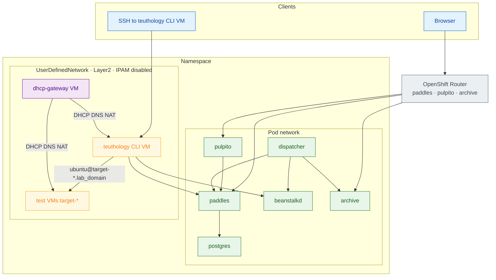

# OpenShift teuthology

The Helm chart in `docs/openshift/` deploys paddles, pulpito, beanstalkd, the job archive, teuthology-dispatcher, PostgreSQL, a namespace-scoped UserDefinedNetwork, a dhcp-gateway VirtualMachine, and a teuthology CLI VirtualMachine. Change cluster-specific settings in `values.yaml` before you install.

This chart does not create test machines. `teuthology-lock` and reimage create and delete those VirtualMachines through the OpenShift provisioner.

| Component | Kind | Role |
|-----------|------|------|
| paddles, pulpito, beanstalk, archive, dispatcher, postgres | Deployment and Service | Lab services. Images default to quay.io/ceph-infra. |
| paddles, pulpito, archive | Route | HTTP unless you add TLS |
| `udn.name` | UserDefinedNetwork | Layer2 overlay with IPAM disabled |
| dhcp-gateway | VirtualMachinePool (replicas=1) | Dual-NIC guest that runs DHCP, DNS, and NAT |
| teuthology | VirtualMachinePool (replicas=1) | Dual-NIC CLI host for lock and SSH to targets |
| allow-openshift-ingress | NetworkPolicy | Lets the OpenShift router reach application pods |

Set these variables so later commands match `values.yaml`:

```bash
export NAMESPACE=teuthology
export LAB_DOMAIN=ocpvirt.local          # dispatcher.labDomain
export MACHINE_TYPE=ocpvirt              # dispatcher.tube
export UDN_NAME=teuthology-net           # udn.name
export SA=teuthology-provisioner
```

## Architecture

The pod network carries HTTP, PostgreSQL, and the beanstalk queue. The UserDefinedNetwork is a private Layer2 overlay for guest addressing. The dhcp-gateway VirtualMachine is the only DHCP, DNS, and NAT server on that overlay. The teuthology CLI VM sits on both networks: it talks to paddles and beanstalk on the pod network, and it reaches `target-*.<lab_domain>` on the UDN through dynamic DNS. Workstations usually cannot route to `udn.gateway`, so run lock and SSH to targets from the CLI VM.



## UserDefinedNetwork

The chart creates a namespace-scoped UserDefinedNetwork named `udn.name`. IPAM is disabled, so OVN only provides Layer2 connectivity. Addresses come from the dhcp-gateway VirtualMachine, not from OVN. OVN also creates a Multus NetworkAttachmentDefinition with the same name. The dhcp-gateway, the teuthology CLI VM, and lock guests attach to it as a secondary NIC using the `l2bridge` binding.

Keep the UDN namespace-scoped so DHCP stays inside this project. The UDN spec is immutable. To change IPAM or the subnet, detach every consumer, delete the UDN, and create it again.

| Key | Description |
|-----|-------------|
| `udn.name` | UDN and NAD name. `openshift.udn_name` must match. |
| `udn.subnet` | Layer2 subnet, for example `192.168.0.0/20` |
| `udn.gateway` | Static address on the dhcp-gateway UDN NIC. Do not assign this to the CLI VM or to targets. |
| `udn.prefix` / `udn.netmask` | Must match `udn.subnet` |
| `udn.dhcpRangeStart` / `udn.dhcpRangeEnd` | Dynamic pool for lock guests |

```bash
oc get userdefinednetwork,network-attachment-definitions -n "$NAMESPACE"
```

The UDN should report `NetworkCreated=True`. If `openshift.udn_name` is empty, guests stay on the masquerade network and do not register in UDN DNS.

## DHCP and gateway

The dhcp-gateway is a VirtualMachinePool with `replicas: 1` and `runStrategy: Always`. It has two NICs: masquerade for the default route and egress, and the UDN NIC identified by `dhcpGateway.mac`. dnsmasq and nftables SNAT run inside the guest, so the pod does not need a privileged SCC. If the VM or VMI is deleted, the pool recreates it.

Service `dhcp-gateway` exposes SSH on port 22 through a LoadBalancer. Guest DNS is not on that Service. dnsmasq listens on the UDN NIC and uses `domain=<dispatcher.labDomain>`. Run only one DHCP and DNS server per namespace on this UDN.

| Item | Rule |
|------|------|
| `dhcpGateway.dhcpHosts` | Infra only. Reserve `teuthology.mac`, `teuthology.ip`, and hostname `teuthology`. |
| `target-*` | Do not add these names to `dhcpHosts`. They take addresses from the dynamic pool and send the paddles shortname as the DHCP hostname. |
| `teuthology.ip` | Static lease just below the DHCP range. Do not use `udn.gateway`. |
| Lock guests | Any free address in `dhcpRangeStart`–`dhcpRangeEnd`. DNS follows the current lease. |
| Stale DNS | An old name can linger until the lease expires (12 hours) unless the guest releases DHCP on teardown. |

Cloud-init copies ConfigMap `dhcp-hosts` into the guest on first boot. After you change infra leases on a running gateway, edit `/etc/dnsmasq.d/dhcp-hosts.conf` and restart dnsmasq, or upgrade Helm and replace the VM disk so cloud-init runs again.

```yaml
dhcpGateway:
  dhcpHosts: |
    dhcp-host=<teuthology.mac>,<teuthology.ip>,teuthology
```

```bash
oc get vmpool,vm,vmi,svc -n "$NAMESPACE" -l app=dhcp-gateway
ssh teuthology@$(oc get svc dhcp-gateway -n "$NAMESPACE" -o jsonpath='{.status.loadBalancer.ingress[0].ip}') \
  'systemctl is-active teuthology-udn-gateway dnsmasq'
```

The default SSH user and password are `teuthology` / `passwd`. Run lock and SSH to `target-*.<lab_domain>` from the teuthology CLI VM, which is already on the UDN and uses this resolver.

## Configuration files

| File | Purpose |
|------|---------|
| `docs/openshift/values.yaml` | Helm: images, UDN, infra VMs, and guest disk defaults |
| `docs/openshift/files/` | Chart assets Helm embeds into manifests (`tpl` / `.Files.Get`): dhcp-gateway and CLI VM scripts/units, and the dispatcher / CLI `teuthology.yaml` templates |
| teuthology.yaml (`openshift:`) | Provisioner: API auth, namespace, UDN, storage, and user-data path |
| `teuthology/ocp/user_data/` | Cloud-init, extra disks, and SSH public keys for **lock** guests |

Edit `docs/openshift/values.yaml` before you deploy. Do not put paddles `target-*` inventory in that file or in `dhcpGateway.dhcpHosts`. Change guest bootstrap or gateway behavior under `files/` (for example `files/dhcp-gateway/`, `files/teuthology/`, `files/dispatcher/`), then upgrade the release. Infra VM cloud-init still runs only on first boot of a new disk. Override any image with `--set *.image=...`. To build locally, use the paddles and pulpito Dockerfiles, `beanstalk/alpine`, or `docs/docker-compose/teuthology/Dockerfile`.

| Key | Required | Description |
|-----|----------|-------------|
| `postgres.password` | Yes | Paddles database password |
| `paddles.workerCount` | Yes | Keep `"4"` so gunicorn does not spawn too many workers |
| `paddles.jobLogHrefTempl` | After first deploy | Archive Route URL |
| `dispatcher.tube` | Yes | Must match paddles `machine_type` |
| `dispatcher.labDomain` | Yes | Appended to short hostnames |
| `*.storageClassName` | If the cluster has no default RWX class | archive PVC and dhcp-gateway / CLI VM disks |
| `openshift.root_storage_class` | At lock | Guest operating-system disk |
| `openshift.data_storage_class` | At lock | Extra disks from user-data `volumes:` |
| `openshift.root_storage_size` / `vcpus` / `ram` | At lock | Guest size |
| `teuthology.mac` / `teuthology.ip` | Yes | Must match `dhcpGateway.dhcpHosts` |
| `teuthology.sshAuthorizedKeys` / `dhcpGateway.sshAuthorizedKeys` | Optional | Public keys for SSH into the **infra** VMs. Guest keys are not this list. |
| `teuthology.dataSource` / `dhcpGateway.dataSource` | Yes | Fedora DataSource for the CLI and dhcp-gateway disks. Set `*.dataSource.namespace` if the DataSource is not in the chart namespace. |

Helm writes `/etc/teuthology.yaml` on the CLI VM and on the dispatcher. Add `server` and `token` on the lock host after first boot. Cloud-init does not run again on a Helm upgrade unless you recreate the VM disk. A workstation copy belongs in `~/.teuthology.yaml`. Do not commit tokens.

```yaml
openshift:
  namespace: <namespace>
  machine_types: ['<machine_type>']
  user_data: teuthology/ocp/user_data/ocp-{os_type}-{os_version}-user-data.txt
  server: https://api.example.com:6443
  token: <service-account-token>
  certificate_authority_data: <base64-ca>   # if TLS verify needs a private CA
  udn_name: <udn.name>                      # empty string disables the UDN NIC
  udn_binding: l2bridge
  datasource_namespace: <datasource-namespace>
  vcpus: 4
  ram: 8Gi
  root_storage_size: 40Gi
  root_storage_class: <rwx-storage-class>
  data_storage_class: <rwx-storage-class>
```

| Key | Required | Description |
|-----|----------|-------------|
| `server` | Yes | OpenShift API URL |
| `token` | Yes | ServiceAccount bearer token |
| `certificate_authority_data` | If TLS needs it | Base64 CA from the cluster kubeconfig |
| `namespace` | Yes | Namespace for VMs and DataVolumes |
| `machine_types` | Yes | Must match `dispatcher.tube` |
| `user_data` | Yes | Path template for cloud-init files |
| `udn_name` | For UDN guests | Multus network name. Empty disables the UDN NIC. |
| `datasource_namespace` | If DataSources are not in `$NAMESPACE` | Namespace of cluster OS DataSources (often `openshift-virtualization-os-images`) |
| `root_storage_class` | Yes | Guest operating-system disk |
| `data_storage_class` | Yes | Extra disks listed under `volumes:` in user-data |

Also set `lab_domain`, `lock_server`, `results_server`, and `queue_host` / `queue_port`. Use the beanstalk LoadBalancer EXTERNAL-IP from a workstation, or the in-cluster Service DNS from the CLI VM and dispatcher.

## Names

`teuthology-lock` looks up `canonicalize_hostname()`, which appends `lab_domain`. The KubeVirt object name and the DHCP hostname stay short. When `udn_name` is set, paddles `mac_address` is required so the provisioner can stamp that MAC on the UDN NIC. That MAC is not a Helm DHCP reservation.

| Layer | Form |
|-------|------|
| paddles `nodes.name` | FQDN: `target-00.<lab_domain>` |
| paddles `mac_address` | Unique per node when UDN is enabled |
| KubeVirt VM and DHCP hostname | shortname: `target-00` |
| SSH and DNS | `target-00.<lab_domain>` maps to the current dhcp-gateway lease |

## Steps

### 1. Deploy

Install the chart, wait until the UDN and both VirtualMachines are Ready, then point paddles at the archive Route. The default `jobLogHrefTempl` is not usable until you do that.

```bash
helm upgrade --install teuthology docs/openshift \
  --namespace "$NAMESPACE" --create-namespace --history-max 3 \
  -f docs/openshift/values.yaml

oc get userdefinednetwork -n "$NAMESPACE"
for d in paddles pulpito beanstalk archive dispatcher paddles-postgres; do
  oc rollout status deploy/$d -n "$NAMESPACE"
done
oc wait -n "$NAMESPACE" --for=condition=Ready vm -l app=dhcp-gateway --timeout=20m
oc wait -n "$NAMESPACE" --for=condition=Ready vm -l app=teuthology --timeout=20m
```

SSH as `teuthology` (default password `passwd`):

```bash
ssh teuthology@$(oc get svc dhcp-gateway -n "$NAMESPACE" -o jsonpath='{.status.loadBalancer.ingress[0].ip}')
ssh teuthology@$(oc get svc teuthology -n "$NAMESPACE" -o jsonpath='{.status.loadBalancer.ingress[0].ip}')
```

```bash
ARCHIVE_HOST=$(oc get route archive -n "$NAMESPACE" -o jsonpath='{.spec.host}')
helm upgrade teuthology docs/openshift \
  --namespace "$NAMESPACE" --history-max 3 \
  --set paddles.jobLogHrefTempl="http://${ARCHIVE_HOST}/{run_name}/{job_id}/teuthology.log" \
  -f docs/openshift/values.yaml
```

```bash
echo "http://$(oc get route pulpito -n "$NAMESPACE" -o jsonpath='{.spec.host}')"
echo "http://$(oc get route paddles -n "$NAMESPACE" -o jsonpath='{.spec.host}')"
```

Use `https://` only when the Routes terminate TLS. A Route that returns **503** while pods are Ready usually means the router cannot reach the pods; the chart NetworkPolicy `allow-openshift-ingress` is meant to fix that.

### 2. ServiceAccount token

Create a ServiceAccount in the namespace with permission to manage VirtualMachines, DataVolumes, and Secrets. Bind the built-in `admin` role in that namespace. Kubernetes 1.24 and later do not mint a long-lived token unless you create a token Secret.

```bash
oc create serviceaccount "$SA" -n "$NAMESPACE"
oc adm policy add-role-to-user admin -z "$SA" -n "$NAMESPACE"

oc apply -n "$NAMESPACE" -f - <<EOF
apiVersion: v1
kind: Secret
metadata:
  name: ${SA}-token
  annotations:
    kubernetes.io/service-account.name: ${SA}
type: kubernetes.io/service-account-token
EOF

SERVER=$(oc whoami --show-server)
TOKEN=$(oc get secret "${SA}-token" -n "$NAMESPACE" -o jsonpath='{.data.token}' | base64 -d)
CA_DATA=$(oc config view --raw --minify -o jsonpath='{.clusters[0].cluster.certificate-authority-data}')
```

Put `server` and `token` under `openshift:` in teuthology.yaml. Add `certificate_authority_data` only when the lock host does not trust the API server CA. On the CLI VM the file is `/etc/teuthology.yaml`.

```bash
oc login --token="$TOKEN" --server="$SERVER"
oc whoami
# system:serviceaccount:<namespace>:<sa>
```

Do not commit tokens. To rotate, delete and recreate Secret `${SA}-token` and replace `openshift.token`.

### 3. SSH keys and extra disks

There are two separate key lists. Do not mix them.

Helm `teuthology.sshAuthorizedKeys` and `dhcpGateway.sshAuthorizedKeys` grant SSH into those infra VirtualMachines. They do not go onto test guests. Password login still works with the chart defaults (`teuthology` / `passwd`).

Guest login keys live in `teuthology/ocp/user_data/ocp-{os_type}-{os_version}-user-data.txt` under `ssh_authorized_keys`. The provisioner does not copy keys from the locker’s `~/.ssh` at lock time. The shipped templates log in as `ubuntu`. Extra disks use a teuthology-only `volumes:` list that is stripped before cloud-init.

On the CLI VM after bootstrap, create a key if needed, then paste the **public** half into both user-data files (not into Helm `sshAuthorizedKeys` unless you also want that key on the CLI VM itself):

```bash
test -f ~/.ssh/id_ed25519 || ssh-keygen -t ed25519 -N '' -f ~/.ssh/id_ed25519
cat ~/.ssh/id_ed25519.pub
cd /opt/teuthology && pip install -e '.[openshift]'
```

### 4. Paddles nodes

Register FQDNs and a unique MAC per node. `machine_type` must match `dispatcher.tube` and `openshift.machine_types`. Set `PGPASSWORD` to `postgres.password`.

```bash
oc exec -i -n "$NAMESPACE" deploy/paddles-postgres -- \
  env PGPASSWORD=secret psql -U paddles -d paddles <<SQL
insert into nodes (name, machine_type, is_vm, locked, up, mac_address) values
('target-00.${LAB_DOMAIN}', '${MACHINE_TYPE}', true, false, false, '52:54:00:d4:ca:00'),
('target-01.${LAB_DOMAIN}', '${MACHINE_TYPE}', true, false, false, '52:54:00:d4:ca:01');
SQL
```

```bash
PADDLES=$(oc get route paddles -n "$NAMESPACE" -o jsonpath='{.spec.host}')
curl -X POST "http://${PADDLES}/nodes/" \
  -H 'Content-Type: application/json' \
  -d "{\"name\":\"target-00.${LAB_DOMAIN}\",\"machine_type\":\"${MACHINE_TYPE}\",\"is_vm\":true,\"up\":true,\"locked\":false,\"mac_address\":\"52:54:00:d4:ca:00\"}"
```

### 5. Lock and reimage

Confirm the cluster has a DataSource for the guest OS before you lock. Infra VMs (dhcp-gateway and the CLI) use the Fedora DataSource in `values.yaml` (`teuthology.dataSource`, `dhcpGateway.dataSource`). Lock and reimage clone a **different** DataSource from `os-type` and `os-version` (for example Ubuntu 22.04). Set `openshift.datasource_namespace` when those objects live outside `$NAMESPACE`.

```bash
oc get datasource -n "${DATASOURCE_NAMESPACE:-openshift-virtualization-os-images}"
```

On the CLI VM, add `/opt/teuthology/.venv/bin` to `PATH`. The provisioner creates a VirtualMachine named with the paddles shortname, attaches the UDN with the paddles MAC, clones that OS DataSource onto the root disk (`root_storage_class`), and adds extra DataVolumes from user-data (`data_storage_class`). Unlock and reimage delete that VM.

```bash
teuthology-lock --lock target-00 --machine-type "$MACHINE_TYPE" --os-type ubuntu --os-version 22.04
getent hosts "target-00.${LAB_DOMAIN}"
ssh ubuntu@"target-00.${LAB_DOMAIN}"
```

The guest obtains an address with DHCP on the UDN. DNS for that name is dhcp-gateway dnsmasq, not CoreDNS.

## Uninstall

Detach remaining VMs from the UDN, then uninstall the release. Helm leaves PVCs in place unless you delete them.

```bash
helm uninstall teuthology -n "$NAMESPACE"
oc delete userdefinednetwork "$UDN_NAME" -n "$NAMESPACE" --ignore-not-found
oc delete pvc -l app=dhcp-gateway -n "$NAMESPACE" --ignore-not-found
oc delete pvc paddles-postgres-data teuthology-archive -n "$NAMESPACE" --ignore-not-found
```
